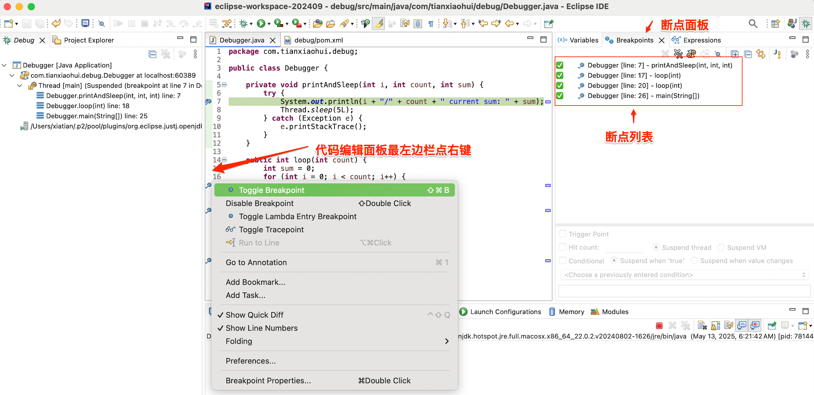
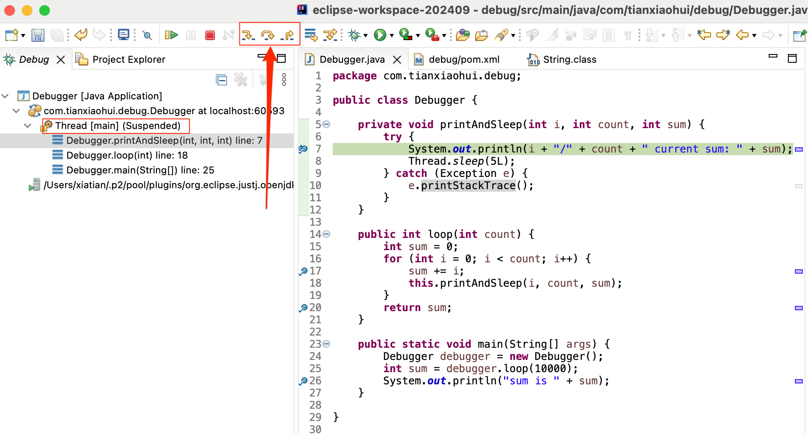
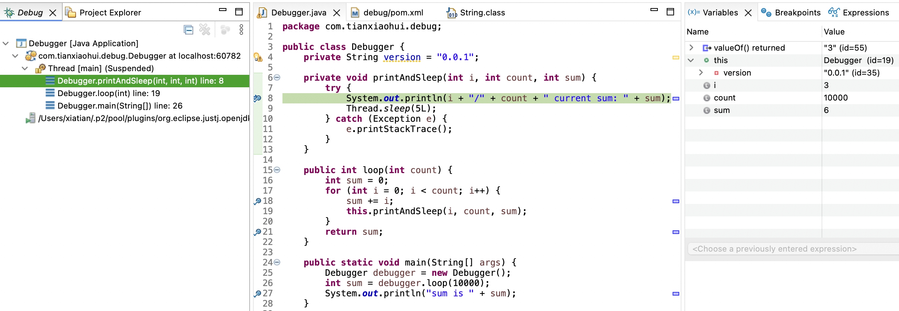

做为一个开发人员, debug 是一项非常重要而且必要的技能. 可是在日常工作中, 很多开发者只会使用 IDE 简单的 debug 功能, 更有甚者, 平时只用 `System.out.print()` 来调试程序. 这大大降低了开发效率, 最终的效果是不仅无法体会到创造的快乐, 而且造成身心俱疲. 

我们将展示如何用常见的 IDE 进行 debug, 介绍如何 debug 远程程序, 还介绍如何在受限的非桌面环境使用 JDK 再带的 jdb 进行 debug. 最后介绍 Java 应用程序 debug 背后的运行机制. 

# 本地 debug
我们将以 Java 开发者最常用的 IDE: IntelliJ IDEA 和 Eclipse 来介绍如何使用 IDE 的 debug 功能. 

## 使用 IntelliJ IDEA 进行本地 debug

## 使用 Eclipse 进行本地 debug
我们这里使用一个很简单的 Java 代码进行演示, 这段代码如下: 
```java
package com.tianxiaohui.debug;

public class Debugger {
	
	private void printAndSleep(int i, int count, int sum) {
		try {
			System.out.println(i + "/" + count + " current sum: " + sum);
			Thread.sleep(5L);
		} catch (Exception e) {
			e.printStackTrace();
		}
	}
	
	public int loop(int count) {
		int sum = 0;
		for (int i = 0; i < count; i++) {
			sum += i;
			this.printAndSleep(i, count, sum);
		}
		return sum;
	}
	
	public static void main(String[] args) {
		Debugger debugger = new Debugger();
		int sum = debugger.loop(10000);
		System.out.println("sum is " + sum);
	}

}
```

### 启动 debug 
通常在当前代码里面点击右键, 然后菜单里面选择 `Debug As` -> `Java Application` 就启动了应用程序. 这时候应用程序已经开始了运行. 如果当前 Eclipse 不是 `Debug` 视图, 它会提醒你是不是打开 `Debug` 视图. 

下面是一个停在某个断点的 `Debug` 视图:


### 添加/删除断点
在代码编辑面板最左侧点右键, 在弹出的菜单中选择 `Toggle Breakpoint` 就可以添加删除断点了. 如果当前行已经是断点, 那么 `Disable Breakpoint` 也可以删除当前断点. `Breakpoints` 面板显示当前所有的断点. 

如下图所示:


### 单步 debug
如下图所示, 在左侧的 `Debug` 面板里, 会显示当前被 debug 进程的所有线程. 截图的应用里面只有一个主线程(main), 状态显示为挂起(suspend), 当鼠标选中某个线程, 或者它的任何一行栈, 我们就能操纵当前线程的执行. 

操纵线程的执行通常需要点击上方的某个单步 debug 按钮. 下图中用红色圈起来的3个是最常用的, 它们分别表示:  
1. Step into: 进入即将执行的下个方法的内部. 如果下图是刚进入第7行, 那么下一步将是把变量 `i` 通过 `String.valueOf()` 转成字符串, 所以, 如果点击 `Step into`, 将会进入 `String.valueOf()` 的方法体. 
2. Step over: 直接执行完当前行, 进入下一行的执行. 
3. Step return: 直接执行完当前方法体, 返回上一层的栈. 如果当前行后面还有其它断点, 虽然你点击了 `Step return`, 它也不会立马返回, 而是执行到下一个断点. 



### 查看断点挂起线程时的变量
当线程挂起时候, 我们可以查看这个线程正在被执行的方法当时变量的值. 

如下图所示, 我们运行到第7行, 然后选择 `Step into` 进入了 `String.valueOf()` 方法, 然后又点击了 `Step return`, 所以又返回到了第7行. 这时, 我们可以看到在右侧的 `Variables` 面板, 它包含一个表格, 表格第一行显示刚刚使用debug返回的方法的返回值. 因为之前的方法是 `valueOf`, 所以, 它的 `Name` 显示为 `valueOf() returned`, 其值是 `3`. 

表格第二行的 `Name` 显示为 `this`, 表示当前的对象. 从最左边的 `Debug` 面板可以看到, 我们现在选择的是 `Debugger.printAndSleep()` 方法, 所以, `this` 指代的是当前 `Debugger` 实例对象. 当表格里的某行表示一个 Java 对象的时候, 它可以展开, 以方便查看该对象的其它字段. 如果某个字段也是对象, 可以递归展开. 

表格的后面几行就是当前栈的局部变量. 



`Variables` 面板展示的内容根据最左侧 `Debug` 面板里面选择的线程, 和线程对应的栈的行而变化的. 

### 设置和观察表达式

# 远程 debug

# 使用命令行 jdb debug

# debug 背后的原理


[Learn more about getting started with this theme.]({{ site.baseurl }}/index.html#getting-started)

---
```
This file is located at: {{ page.path }}
```
---
